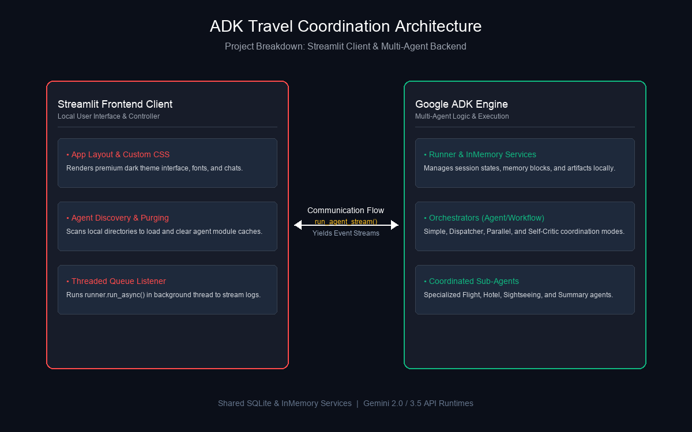

# ADK Agent Studio & Workflows Hub

This project is a local workspace for developing, running, and analyzing multi-agent workflows built with Google's **Agent Development Kit (ADK)** and the **Gemini API**. It contains two primary components: a multi-agent backend travel planning system and a premium interactive Streamlit chat interface.

---

## 📂 Project Structure

```text
samples/
├── .gitignore                    # Local environment files, pycache, and logs ignore patterns
├── README.md                     # Project documentation
├── logs/                         # Observability traces and execution logs
│   ├── observability_trace.txt   # Compiled agent communication logs
│   └── nz_observability_trace.txt # Flight/hotel search communication logs
├── images/                       # High-resolution diagrams and screenshots
│   ├── final_itinerary_screenshot.png # Streamlit UI final itinerary screenshot
│   ├── observability_trace_screenshot.png # Streamlit UI observability trace screenshot
│   ├── project_architecture.png  # Server & client breakdown diagram
│   ├── request_response_flow.png # Step-by-step request/response flowchart
│   ├── simple_agent_workflow.png # High-res simple workflow sequence diagram
│   ├── parallel_agent_workflow.png # High-res parallel workflow sequence diagram
│   └── parallel_agent_architecture.png # Enhanced high-level agent architecture diagram
├── google-adk-workflows/         # Multi-Agent backend orchestration modules
│   ├── env.example               # Template environment settings
│   ├── .env                      # Local key configurations (ignored)
│   ├── weather_server.py         # Local FastMCP weather server
│   ├── subagent.py               # Core specialists (Flight, Hotel, Sightseeing, Weather, Summary)
│   ├── simple/                   # Sequential coordination coordinator
│   ├── dispatcher/               # Tool-based router coordinator
│   ├── parallel/                 # Concurrent executor coordinator
│   └── self_critic/              # QA Validator coordination loop
└── streamlit_client/             # Interactive Streamlit frontend client
    ├── app.py                    # Main Streamlit client source file
    ├── requirements.txt          # Client dependencies
    └── .env                      # Local client key configurations (ignored)
```

---

## 🏗️ Architecture Overview

The workspace separates **Agent Logic** from the **Client User Interface**:



1. **Agent Backend (`google-adk-workflows/`)**: Implements specialized agents (Flight, Hotel, Sightseeing, and Compilation agents) and defines workflows (Simple, Dispatcher, Parallel, and Self-Critic) that coordinate how they run sequentially or concurrently.
2. **Streamlit Client (`streamlit_client/`)**: Scans the workspace directory to discover agents on disk, dynamically configures runtime parameters (Gemini API Key and Model Name), purges Python's module cache to hot-reload changes instantly, and streams agent outputs live using a background thread and a thread-safe event queue.

---

## 🚀 Quick Start

### 1. Prerequisites
- **Python 3.13+**
- A **Google Gemini API Key** (obtainable from [Google AI Studio](https://aistudio.google.com/app/apikey))

### 2. Configure Environment Variables
You must set your credentials in a local environment file. 
Copy the `.env` template to both the client and workflows directories:

```bash
# Set up client environment variables
cp google-adk-workflows/env.example streamlit_client/.env

# Set up workflows environment variables
cp google-adk-workflows/env.example google-adk-workflows/.env
```

Open both `.env` files and add your actual API Key:
```env
GOOGLE_API_KEY=your_actual_api_key_here
MODEL_NAME=gemini-3.5-flash
```

*(Alternatively, you can input your key directly into the Streamlit sidebar config panel during runtime).*

### 3. Run the Streamlit Interface
Start the application server using your configured Python virtual environment:

```bash
# Run from the project root directory
python -m streamlit run streamlit_client/app.py --browser.gatherUsageStats false
```

Once running, navigate to the local URL (usually **[http://localhost:8501](http://localhost:8501)**) in your web browser.

---

## 🌤️ MCP Weather Integration

To retrieve real-time weather details for the travel planning system, the application implements a Model Context Protocol (MCP) weather integration:

### 1. Local Weather Server (`weather_server.py`)
- Built using the Python `mcp` library and the `FastMCP` framework.
- Exposes a `get_current_weather(location: str)` tool.
- Fetches real-time reports via `https://wttr.in/` using `httpx` (returns a single-line summary with emojis).
- Provides pre-defined mock forecasts for Tokyo, Paris, and New Delhi as local fallbacks if offline.
- Communicates using standard input/output (`stdio`) transport.

### 2. Weather Agent (`WeatherAgent` in `subagent.py`)
- Utilizes the `McpToolset` class to connect to the weather server subprocess.
- Defines communication params via `StdioConnectionParams` and `StdioServerParameters` pointing to the virtualenv Python interpreter and the server script.
- Queries `WeatherService` and outputs a structured JSON response decorated with weather emojis (e.g. 🌡️, 🌤️, 👕, 🧥).

### 3. Workflow Integration
- **Simple Coordinator**: Invokes the `WeatherAgent` sequentially as a sub-agent.
- **Dispatcher Coordinator**: Invokes the `WeatherAgent` as an `AgentTool` based on dynamic intent routing.
- **Parallel Coordinator**: Resolves flight search, hotel search, and weather details concurrently.
- **Self-Critic Coordinator**: Validates the presence of weather information and relevant emojis in the final travel summary via a dedicated critique agent (`TripSummaryReviewer`).

---

## 🔄 Sample Request & Response Flow

Here is a visual flowchart demonstrating how a user's prompt (e.g. "Book a flight & hotel in Paris") is processed sequentially by the Streamlit frontend UI, the ADK runner orchestrator, the individual agent nodes, and the Gemini API:


1. **User Prompt**: The user enters a trip coordination request on the Streamlit UI.
2. **Async Run**: The UI thread delegates the prompt execution asynchronously to the ADK `Runner` running inside a background worker thread.
3. **Sub-agent Execution**: The active coordinator (e.g. `simple` workflow) identifies required details and makes sequential prompts (via instructions) to sub-agents (`FlightAgent`, `HotelAgent`).
4. **Gemini Calls**: Each sub-agent calls the Gemini LLM with its specialized role instructions to generate structured outputs.
5. **Live Updates**: As each agent finishes, the runner yields intermediate status updates. The UI worker thread puts these into a queue to render them live in the web browser.
6. **Compilation**: Finally, `TripSummaryAgent` formats the responses into a markdown itinerary, which is rendered as the assistant's final response.

---

## ⚙️ Features

- **Workflow Selector**: Switch between different multi-agent coordination modes (Simple, Dispatcher, Parallel, Self-Critic) on the fly.
- **Model Selector**: Switch target runtimes between **Gemini 3.5 Flash** (`gemini-3.5-flash`), **Gemini 3.1 Pro - Preview** (`gemini-3.1-pro-preview`), and **Gemini 3.1 Flash Lite** (`gemini-3.1-flash-lite`).
- **Real-Time Response Streaming**: Assistant responses stream token-by-token and agent-by-agent in real-time as they are yielded by the ADK event stream.
- **Explicit Thinking Indicator & Spinner**: Displays a clean spinning icon ("Agent is still working on your query...") at the bottom of the chat layout while the agents are executing background operations, closing automatically as soon as the final compilation finishes.
- **Cache Reloading**: Edit agent files locally and click **Reload Agent Source** to clear memory caches and load your new agent parameters immediately.
- **Sub-Agent Live Logging**: View real-time status updates of intermediate agent runs (e.g. `FlightAgent` executing, `HotelAgent` booking) inside collapsed status drawers before the final compiled answer arrives.
- **Observability Sequence Diagrams**: Creates sequence flow diagrams (`simple_agent_workflow.png` and `parallel_agent_workflow.png` in the `images/` directory) and detailed trajectory logs in the `logs/` directory.
