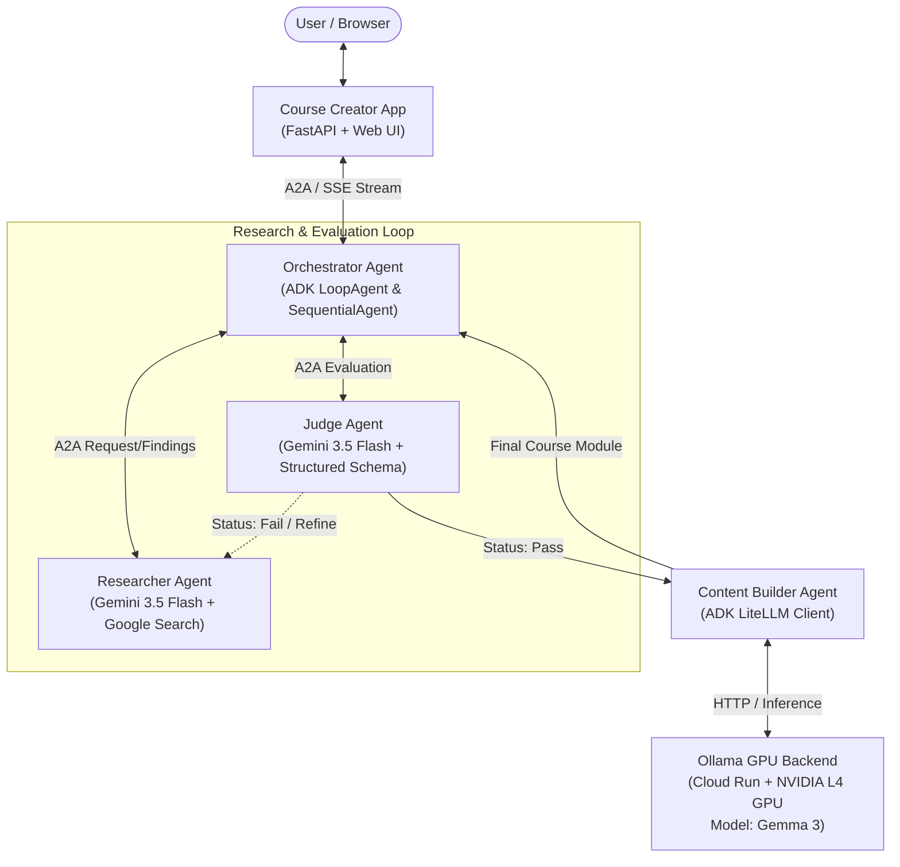
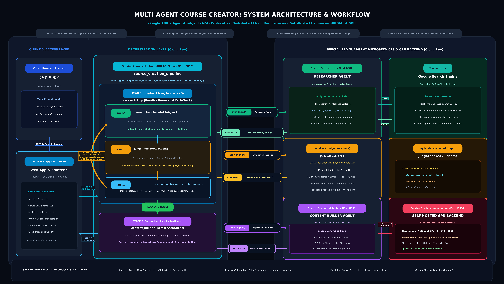

# Multi-Agent Course Creator with Self-Hosted Gemma on GPU

A distributed multi-agent system built with Google's **Agent Development Kit (ADK)** and **Agent-to-Agent (A2A)** protocol. It coordinates a team of microservice agents that research, judge, and generate structured educational courses, deploying seamlessly across **Google Cloud Run**.

The **Content Builder** agent is powered by a **self-hosted Gemma 3 model** running on **Cloud Run with NVIDIA L4 GPU** via Ollama, demonstrating how to integrate self-hosted open-weights models alongside proprietary frontier models in an enterprise multi-agent workflow.

---

## 🏗️ Architecture & Agent Flow



### Microservice Architecture (6 Cloud Run Services)

1. **Ollama Backend (`ollama-gemma-gpu`)**:
   - Runs Ollama on Cloud Run backed by an **NVIDIA L4 GPU**.
   - Pre-loads and serves Google's **Gemma 3** (default: `gemma3:270m` or configurable up to `gemma3:12b`).
2. **Researcher Service (`researcher`)**:
   - Autonomous research specialist using `gemini-3.5-flash` with the `google_search` tool.
   - Summarizes verified information to satisfy the user's prompt.
3. **Judge Service (`judge`)**:
   - Strict evaluator agent using `gemini-3.5-flash` with Pydantic structured output (`JudgeFeedback`).
   - Determines if the gathered research passes quality criteria or needs refinement.
4. **Content Builder Service (`content_builder`)**:
   - Synthesizes approved research into a polished educational course module.
   - Interfaces with the self-hosted Gemma model via `LiteLlm` and `AuthLiteLLMClient`.
5. **Orchestrator Service (`orchestrator`)**:
   - Central workflow coordinator managing the `LoopAgent` cycle between Researcher and Judge.
   - Escalates to Content Builder once research is approved.
   - Communicates with peer agents via `RemoteA2aAgent` with IAM service-to-service authentication.
6. **Agent App (`course-creator`)**:
   - FastAPI server serving a responsive frontend with Server-Sent Events (SSE) streaming and OpenTelemetry Cloud Trace integration.

### Agent Workflow Architecture

The diagram below illustrates the end-to-end multi-agent orchestration, the iterative research and critique loop between the Researcher and Judge, and the dedicated GPU inference pipeline with Gemma:



* **Stage 1 (Research & Evaluation Loop):** The Orchestrator initiates an iterative feedback loop (up to 3 iterations) where the **Researcher** gathers verified web context via Google Search, and the **Judge** performs deterministic schema-based grading.
* **Stage 2 (Course Synthesis):** Once research passes evaluation, the Orchestrator escalates to the **Content Builder**, which prompts the self-hosted **Gemma 3 model on NVIDIA L4 GPU** via LiteLLM to compile the structured course module.
* **Stage 3 (Streaming Delivery):** Lifecycle events and completed course markdown stream to the **Agent App** via Server-Sent Events (SSE).

---

## 📂 Project Structure

```text
GCP/Gemma/multi-agent-system/
├── .env.example             # Template environment variables
├── .gitignore               # Ignored virtual environments, caches, and local secrets
├── README.md                # Project documentation
├── deploy.sh                # End-to-end automated deployment script for Cloud Run
├── pyproject.toml           # Python package configuration and dependencies (uv)
├── uv.lock                  # Pinned dependency lockfile
├── images/                  # High-resolution architectural workflow diagrams
│   └── agent_workflow_architecture.png
├── docs/                    # Architectural reports & documentation
│   └── workflow_architecture_report.md
├── ollama-backend/          # GPU backend service definition
│   └── Dockerfile           # Ollama container image with pre-pulled Gemma model
├── agents/                  # ADK A2A Microservices
│   ├── orchestrator/        # Main coordinator (LoopAgent, SequentialAgent, run.sh)
│   │   ├── agent.py
│   │   ├── run.sh
│   │   └── Dockerfile
│   ├── researcher/          # Information retrieval agent (Gemini 3.5 Flash)
│   │   ├── agent.py
│   │   └── Dockerfile
│   ├── judge/               # Quality evaluator agent (Structured feedback)
│   │   ├── agent.py
│   │   └── Dockerfile
│   └── content_builder/     # Course generator (Gemma via LiteLLM)
│       ├── agent.py
│       ├── litellmclientx.py
│       └── Dockerfile
├── app/                     # Web Application
│   ├── main.py              # FastAPI server with SSE streaming & Cloud Trace
│   ├── Dockerfile           # App container definition
│   └── frontend/            # Static assets (HTML, CSS, JS)
└── shared/                  # Shared A2A & Auth Library (symlinked into agents)
    ├── a2a_utils.py         # Cloud Run A2A agent-card rewrite & IAM authentication
    ├── adk_app.py           # CLI runner for ADK A2A server applications
    └── authenticated_httpx.py # Service-to-service IAM authenticated HTTP client
```

---

## ⚙️ Prerequisites & Setup

### 1. Requirements
*   **Python**: Version `3.10` to `3.13`
*   **uv**: Fast Python package installer (`curl -LsSf https://astral.sh/uv | sh`)
*   **Google Cloud SDK**: (`gcloud` CLI installed and authenticated)
*   **Ollama** *(optional, for local development)*: [ollama.ai](https://ollama.ai)

### 2. Environment Configuration
Copy the template environment file and set your GCP project details:

```bash
cp .env.example .env
```

Edit `.env` with your values:
```bash
export GOOGLE_CLOUD_PROJECT="your-gcp-project-id"
export GOOGLE_CLOUD_LOCATION="asia-southeast1" # Or us-central1, europe-west1, etc.
export GOOGLE_GENAI_USE_VERTEXAI="true"
```

> [!IMPORTANT]
> Keep `.env` ignored in `.gitignore`. Never commit real Google Cloud Project IDs, credentials, or API keys to version control.

### 3. Install Dependencies Locally
```bash
uv sync
```

---

## 🚀 Deployment to Google Cloud Run

The automated deployment script [deploy.sh](file:///home/samaujs/Year_2026/gen_ai/Gen-AI/GCP/Gemma/multi-agent-system/deploy.sh) builds container images with Cloud Build and deploys all 6 services with proper IAM service-to-service permissions.

### Step 1: Prepare GCP Project and Quotas
```bash
# Set your active project
gcloud config set project YOUR_PROJECT_ID

# Enable required Google Cloud APIs
gcloud services enable \
  run.googleapis.com \
  cloudbuild.googleapis.com \
  aiplatform.googleapis.com \
  compute.googleapis.com

# Verify GPU quota for Cloud Run in your selected region (e.g., us-central1 or asia-southeast1)
```

### Step 2: Run Deployment
```bash
./deploy.sh
```

### Deployment Sequence:
1. **Ollama GPU Backend** (`ollama-gemma-gpu`): Deploys first with 1x NVIDIA L4 GPU, 8 vCPUs, and 16 GiB RAM.
2. **Researcher** (`researcher`): Deploys A2A microservice with Vertex AI access.
3. **Content Builder** (`content-builder`): Connects to the newly deployed Ollama backend URL.
4. **Judge** (`judge`): Deploys structured feedback microservice.
5. **Orchestrator** (`orchestrator`): Binds the Agent Cards of Researcher, Judge, and Content Builder.
6. **Course Creator App** (`course-creator`): Deploys the public web interface connected to the Orchestrator.

### Configurable Deployment Options

| Environment Variable | Default | Description |
| :--- | :--- | :--- |
| `GEMMA_MODEL_NAME` | `gemma3:270m` | Gemma model tag to pull and run in Ollama (e.g. `gemma3:270m`, `gemma3:12b`). |
| `OLLAMA_REGION` | `${GOOGLE_CLOUD_LOCATION}` | Regional override for GPU availability (e.g. `us-central1`). |
| `GOOGLE_CLOUD_PROJECT` | `gcloud config` | Target Google Cloud Project ID. |
| `GOOGLE_CLOUD_LOCATION`| `us-east4` | Default compute region for CPU services. |

Example using a larger Gemma model:
```bash
export GEMMA_MODEL_NAME="gemma3:12b"
export OLLAMA_REGION="us-central1"
./deploy.sh
```

---

## 💻 Local Development

### Running the Ollama Model Locally
```bash
ollama serve
ollama pull gemma3:270m
```

### Running Microservices Individually
Each agent can be run using the shared ADK runner:

```bash
# Researcher (Port 8001)
cd agents/researcher
python3 adk_app.py --host 0.0.0.0 --port 8001 --a2a .

# Judge (Port 8002)
cd agents/judge
python3 adk_app.py --host 0.0.0.0 --port 8002 --a2a .

# Content Builder (Port 8003)
cd agents/content_builder
export OLLAMA_API_BASE="http://localhost:11434"
export GEMMA_MODEL_NAME="gemma3:270m"
python3 adk_app.py --host 0.0.0.0 --port 8003 --a2a .

# Orchestrator (Port 8080)
cd agents/orchestrator
export RESEARCHER_AGENT_CARD_URL="http://localhost:8001/a2a/agent/.well-known/agent-card.json"
export JUDGE_AGENT_CARD_URL="http://localhost:8002/a2a/agent/.well-known/agent-card.json"
export CONTENT_BUILDER_AGENT_CARD_URL="http://localhost:8003/a2a/agent/.well-known/agent-card.json"
python3 adk_app.py --host 0.0.0.0 --port 8080 --a2a .

# Web App Frontend (Port 8000)
cd app
export AGENT_SERVER_URL="http://localhost:8080"
python3 main.py
```

Open **http://localhost:8000** in your browser to interact with the course creation studio.

---

## 🔒 Security & PII Protection

*   **No Hardcoded Secrets**: All inter-service communications leverage short-lived Google OAuth2 Identity Tokens dynamically requested via IAM credentials.
*   **Sanitized Configurations**: All sample files, scripts, and documentation use placeholder variables (`your-gcp-project-id`).
*   **Exclusion Rules**: Local `.env` files, caches, and test artifacts are protected under `.gitignore`.

---

## 📚 References

[1] [Google Cloud Platform DevRel Demos: Multi-Agent System](https://github.com/GoogleCloudPlatform/devrel-demos/tree/main/agents/multi-agent-system)

