# Multi-Agent System Architecture & Workflow

A high-resolution, publication-grade architectural diagram has been generated and saved to your repository.


---

## Key Highlights of the Architecture

### 1. 6 Distributed Cloud Run Microservices
| # | Service Name | Port | Base Engine / LLM | Primary Role |
|---|---|---|---|---|
| **1** | **`app`** | `8000` | FastAPI + Web UI | User interface, session management, SSE streaming |
| **2** | **`orchestrator`** | `8000` | Google ADK Server | Pipeline orchestration (`SequentialAgent` & `LoopAgent`) |
| **3** | **`researcher`** | `8001` | `gemini-3.5-flash` (Vertex AI) | Web research via Google Search tool |
| **4** | **`judge`** | `8002` | `gemini-3.5-flash` (Vertex AI) | Deterministic fact-checking & structured critique |
| **5** | **`content_builder`** | `8003` | LiteLLM Client | Formats course modules using self-hosted Gemma |
| **6** | **`ollama-gemma-gpu`** | `11434` | Self-Hosted Gemma 3 on GPU | Cloud Run container with 1x NVIDIA L4 GPU, 8 vCPU, 16GB RAM |

---

## 2. End-to-End Workflow & Interactions

```mermaid
sequenceDiagram
    autonumber
    actor User as End User
    participant App as Web App (FastAPI)
    participant Orch as Orchestrator (ADK)
    participant Res as Researcher (A2A)
    participant Search as Google Search API
    participant Judge as Judge (A2A)
    participant CB as Content Builder (A2A)
    participant Ollama as Ollama GPU (L4)

    User->>App: Input topic prompt
    App->>Orch: POST session & initiate pipeline
    
    rect rgb(20, 30, 50)
    note over Orch,Judge: Stage 1: Research & Critique Loop (max 3 iters)
    loop Up to 3 iterations
        Orch->>Res: A2A Call: Research topic (+ prior critique)
        Res->>Search: Query web sources
        Search-->>Res: Return grounding snippets
        Res-->>Orch: Return findings -> saved to state['research_findings']
        
        Orch->>Judge: A2A Call: Evaluate findings against prompt
        Judge-->>Orch: Return JudgeFeedback JSON -> saved to state['judge_feedback']
        
        alt Feedback status == 'pass'
            note over Orch: EscalationChecker yields escalate=True (Break Loop)
        else Feedback status == 'fail' & iters < 3
            note over Orch: Loop continues: pass critiques back to Researcher
        end
    end
    end

    rect rgb(35, 20, 50)
    note over Orch,Ollama: Stage 2: Course Synthesis
    Orch->>CB: A2A Call: Synthesize course with approved research
    CB->>Ollama: POST /api/chat (LiteLLM -> Gemma 3 on NVIDIA L4 GPU)
    Ollama-->>CB: Fast GPU token stream (100+ tok/s)
    CB-->>Orch: Return structured Markdown course
    end

    Orch-->>App: SSE stream real-time events & final course
    App-->>User: Display course with interactive table of contents
```



---

## README.md Ready Snippet

You can embed this diagram directly into your `README.md` by referencing the image in `assets/`:

```markdown
## Architecture & Workflow


```

File paths generated:
- `docs/agent_workflow_architecture.png` (7950 x 4500 px, 300 DPI)
- `assets/agent_workflow_architecture.png` (7950 x 4500 px, 300 DPI)
